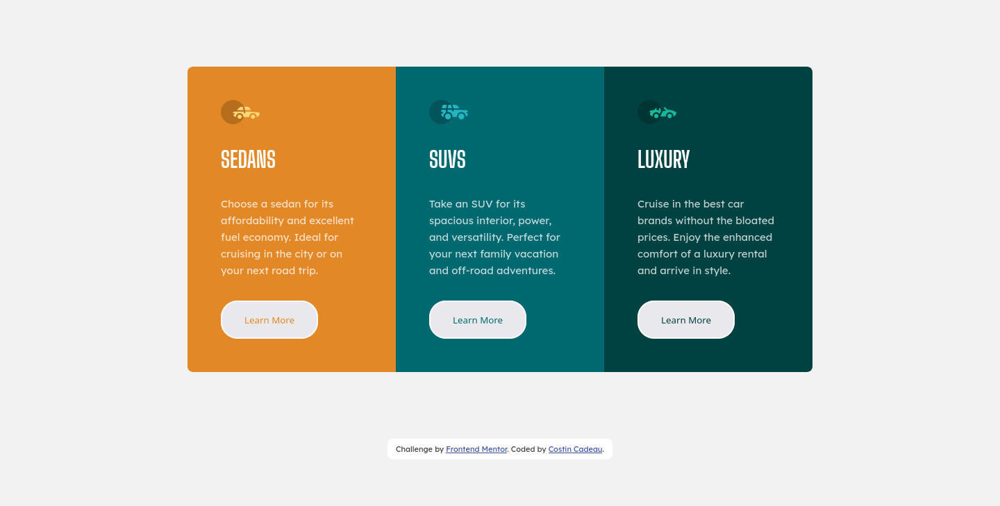
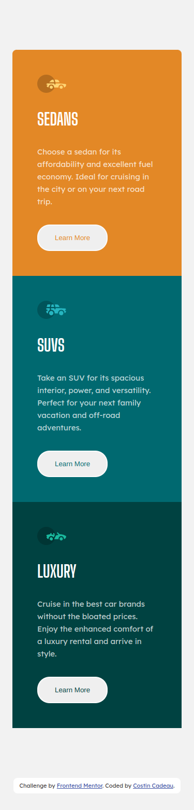

# Frontend Mentor - 3-column preview card component solution

This is a solution to the [3-column preview card component challenge on Frontend Mentor](https://www.frontendmentor.io/challenges/3column-preview-card-component-pH92eAR2-). Frontend Mentor challenges help you improve your coding skills by building realistic projects. 

## Table of contents

- [Overview](#overview)
  - [The challenge](#the-challenge)
  - [Screenshot](#screenshot)
  - [Links](#links)
- [My process](#my-process)
  - [Built with](#built-with)
  - [Useful resources](#useful-resources)
- [Author](#author)

## Overview

### The challenge

Users should be able to:

- View the optimal layout depending on their device's screen size
- See hover states for interactive elements

### Screenshot

#### Desktop version :

#### Mobile version :

### Links

- Solution URL: [Repo github](https://github.com/c-costin/3-column-preview-card-component)
- Live Site URL: [Live website](https://)

## My process

### Built with

- Semantic HTML5 markup
- CSS custom properties
- Mobile-first workflow
- Flexbox
- Media Queries

### Useful resources

- [MDN web docs](https://developer.mozilla.org/en-US/) - I used this docs to remember the properties and for media queries in CSS.

## Author

- Website - [costincadeau.fr](https://costincadeau.fr)
- Frontend Mentor - [@c-costin](https://www.frontendmentor.io/profile/c-costin)
